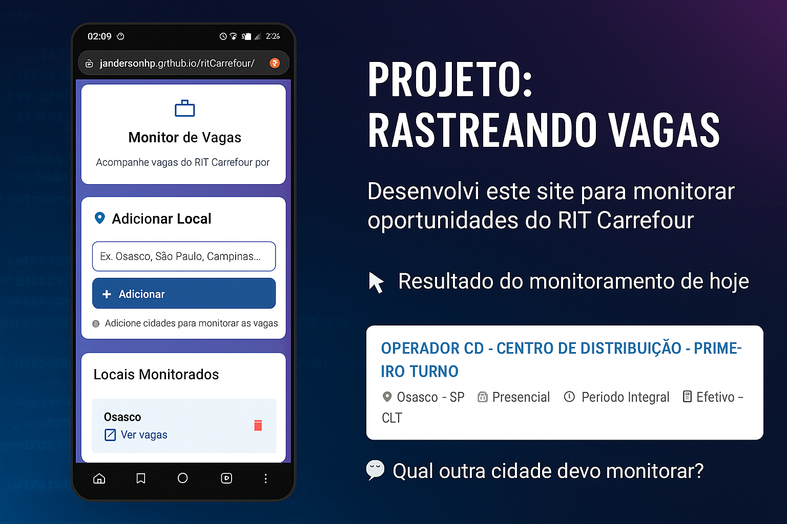

# Monitor de Vagas Carrefour - RIT

## 📋 Sobre o Projeto

Este projeto foi desenvolvido para facilitar o acompanhamento do **RIT (Recrutamento Interno) do Carrefour**, criando uma ferramenta prática e eficiente para monitorar vagas de emprego em diferentes localidades da empresa.

Como profissional em busca de oportunidades no mercado, percebi a necessidade de ter um sistema que permitisse acompanhar de forma organizada as vagas disponíveis em diversas cidades, evitando a repetição manual de buscas no site oficial do Carrefour.

## 🔗 Link para o Site
[Monitarar RIT Carrefour](https://jandersonhp.github.io/ritCarrefour/)

## 🎯 Objetivo

O **Monitor de Vagas Carrefour** surgiu da necessidade de:
- Centralizar em um único lugar o monitoramento de vagas por localidade
- Agilizar o processo de consulta diária às oportunidades
- Manter um histórico pessoal de locais de interesse
- Otimizar o tempo durante buscas por emprego

## 💼 Contexto do Portfolio

Este projeto foi especialmente selecionado para compor meu portfolio por demonstrar habilidades essenciais no desenvolvimento front-end:

### **Habilidades Técnicas Demonstradas:**
- **HTML5 Semântico**: Estrutura limpa e acessível
- **CSS3 Moderno**: Utilizando Grid, Flexbox, variáveis CSS e design responsivo
- **JavaScript ES6+**: Manipulação do DOM, localStorage e eventos
- **Design Responsivo**: Mobile-first approach
- **UX/UI**: Foco na experiência do usuário com feedback visual
- **Performance**: Código otimizado e carregamento eficiente

### **Diferenciais do Projeto:**
- **Problema Real**: Soluciona uma necessidade genuína de quem busca emprego
- **Design Moderno**: Interface atualizada seguindo tendências atuais
- **Usabilidade**: Foco na experiência do usuário final
- **Performance**: Aplicação leve e rápida

## 🚀 Funcionalidades Principais

### ✅ **Gestão de Localidades**
- Adicionar novas cidades para monitoramento
- Remover localidades quando não forem mais necessárias
- Persistência de dados no localStorage

### ✅ **Acesso Rápido**
- Cards clicáveis que redirecionam diretamente para as vagas
- Links pré-configurados com os filtros adequados
- Abertura em nova aba para não perder o contexto

### ✅ **Interface Intuitiva**
- Design responsivo que funciona perfeitamente em mobile
- Feedback visual imediato nas ações
- Estados vazios para melhor orientação do usuário
- Animações suaves para melhor experiência

## 🛠️ Tecnologias Utilizadas

- **HTML5**: Estrutura semântica e acessível
- **CSS3**: Estilização moderna com Grid, Flexbox e variáveis
- **JavaScript Vanilla**: Funcionalidades e interatividade
- **Material Icons**: Ícones para melhor interface
- **LocalStorage**: Persistência local de dados

## 📱 Design e Experiência

O projeto foi desenvolvido com foco em:

### **Mobile-First**
- Layout totalmente responsivo
- Touch-friendly para dispositivos móveis
- Otimizado para diferentes tamanhos de tela

### **Acessibilidade**
- Cores com bom contraste
- Navegação por teclado
- Feedback visual para todas as ações

### **Performance**
- Código otimizado e leve
- Carregamento rápido
- Animações com CSS para melhor performance

## 🌟 Destaques Técnicos

### **Arquitetura do Código**
- Separação clara entre HTML, CSS e JavaScript
- Funções modularizadas e reutilizáveis
- Código limpo e bem comentado

### **Recursos Avançados**
- CSS Variables para consistência visual
- Grid Layout para organização dos cards
- Event delegation para melhor performance
- LocalStorage para persistência de dados

## 📈 Próximas Melhorias

- [ ] Sistema de notificações para novas vagas
- [ ] Favoritar vagas específicas
- [ ] Compartilhamento de listas de monitoramento
- [ ] Dark mode
- [ ] Exportação de dados

---

**Desenvolvido com foco em resolver problemas reais e demonstrar habilidades em desenvolvimento front-end moderno.**